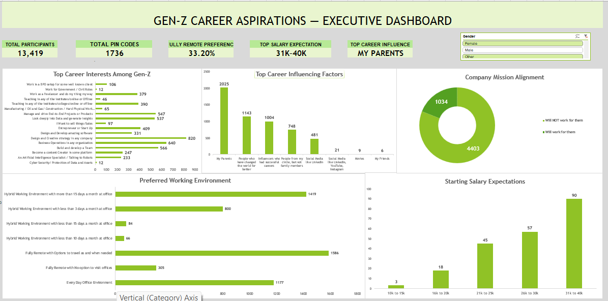

# Gen-Z Career Aspirations in India – Data Analysis

## 📊 Project Overview

This project analyzes the career aspirations, workplace preferences, and career expectations of Gen-Z in India.

The analysis was performed using Microsoft Excel to identify patterns, trends, and key insights related to career choices and workplace preferences.

## 🛠️ Tools & Skills

- Microsoft Excel
- Data Cleaning
- Data Validation
- PivotTables
- Data Analysis
- Data Visualization
- Charts & Dashboard

## 🔍 Analysis Areas

- Career aspirations
- Career and industry preferences
- Higher education plans
- Preferred work environment
- Salary expectations
- Workplace preferences
- Employer preferences
- Social impact and career values

## 📈 Project Workflow

1. Data cleaning and validation
2. Exploratory data analysis
3. PivotTable-based analysis
4. Chart and dashboard creation
5. Identification of key trends and insights

## 💡 Key Skills Demonstrated

**Excel | Data Cleaning | Data Analysis | PivotTables | Data Visualization | Dashboard Development**

## 📌 About the Project

This project was completed as part of a Data Analytics internship project with KultureHire.

> The original dataset and raw respondent-level data are not included in this repository due to confidentiality requirements.
>
> ## 📊 Executive Dashboard

## 💡 Key Insights

- Parents were the most influential factor reported in career decisions.
- Fully remote work with flexibility to travel was a highly preferred working arrangement.
- The most common starting salary expectation was ₹31K–₹40K.
- Company mission alignment was an important consideration for respondents.
- Gen-Z showed diverse career interests across technology, business, creative, and other fields.
